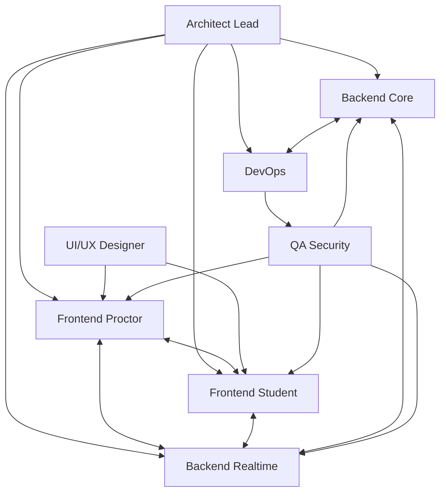

# SimpleProctoring MVP - Agent Dispatch Configuration
## Project: Simple Proctoring Application MVP
## Duration: 6 weeks
## Total Agents: 8

---

## Agent Roster & Responsibilities

### Agent 1: System Architect & Tech Lead
**ID**: `architect-lead`  
**Expertise**: System Design, WebRTC, Distributed Systems, TypeScript  
**Primary Tools**: Node.js, Docker, Kubernetes, PostgreSQL, Redis  

**Responsibilities**:
```yaml
tasks:
  week_1:
    - Design complete system architecture diagrams
    - Setup monorepo structure (Turborepo/Nx)
    - Define API contracts and interfaces
    - Create WebRTC signaling server architecture
    - Establish coding standards and conventions
    - Setup development environment (Docker Compose)
  
  week_2_6:
    - Code review all PRs
    - Resolve architectural blockers
    - Optimize WebRTC performance
    - Design database schema
    - Implement core service interfaces
    - Coordinate agent integration points

deliverables:
  - Architecture documentation
  - API specification (OpenAPI 3.0)
  - Database schema
  - WebRTC signaling server
  - Docker configuration
```

---

### Agent 2: Frontend Lead - Proctor Interface
**ID**: `frontend-proctor`  
**Expertise**: React, TypeScript, WebRTC Client, UI/UX  
**Primary Tools**: React 18, Vite, TailwindCSS, Socket.io-client  

**Responsibilities**:
```yaml
tasks:
  week_1:
    - Setup React + TypeScript + Vite project
    - Implement authentication flow UI
    - Create proctor dashboard layout
    
  week_2_3:
    - Build session creation interface
    - Implement proctor monitoring dashboard
    - Create multi-stream video grid component
    - Add session controls (start/stop/pause)
    
  week_4_6:
    - Integrate WebRTC for receiving streams
    - Implement real-time participant status
    - Add recording controls UI
    - Build session history view

deliverables:
  - Proctor dashboard
  - Session management UI
  - Monitoring interface with video grid
  - Session controls panel
```

**Code Structure**:
```typescript
// src/components/ProctorDashboard/
├── SessionGrid.tsx
├── ParticipantCard.tsx
├── MonitoringControls.tsx
├── StreamViewer.tsx
└── SessionRecorder.tsx
```

---

### Agent 3: Frontend Developer - Student Interface
**ID**: `frontend-student`  
**Expertise**: React, WebRTC Media Capture, Browser APIs  
**Primary Tools**: React, MediaRecorder API, Screen Capture API  

**Responsibilities**:
```yaml
tasks:
  week_1:
    - Create student landing page
    - Build device permission flow
    - Implement waiting lobby UI
    
  week_2_3:
    - Create media device testing interface
    - Build screen/camera/audio selectors
    - Implement pre-session checklist
    
  week_4_6:
    - Integrate WebRTC streaming
    - Add in-session chat UI
    - Create connection status indicators
    - Build error recovery UI

deliverables:
  - Student lobby interface
  - Device testing components
  - Media streaming interface
  - Real-time chat component
```

**Code Structure**:
```typescript
// src/components/StudentInterface/
├── Lobby.tsx
├── DeviceCheck.tsx
├── MediaStreamer.tsx
├── ChatPanel.tsx
└── ConnectionStatus.tsx
```

---

### Agent 4: Backend Engineer - Core Services
**ID**: `backend-core`  
**Expertise**: Node.js, Fastify, PostgreSQL, Authentication  
**Primary Tools**: Fastify, Prisma, Passport.js, JWT  

**Responsibilities**:
```yaml
tasks:
  week_1:
    - Setup Fastify server with TypeScript
    - Implement database models (Prisma)
    - Create authentication service
    
  week_2_3:
    - Build session management API
    - Implement user management service
    - Create SSO integration (Google/Microsoft)
    - Add JWT token management
    
  week_4_6:
    - Build participant management
    - Implement session scheduling
    - Create analytics endpoints
    - Add audit logging

deliverables:
  - RESTful API server
  - Authentication system with SSO
  - Session management service
  - Database integration layer
```

**API Endpoints**:
```typescript
// Core API Routes
POST   /auth/login
POST   /auth/sso/:provider
GET    /sessions
POST   /sessions
GET    /sessions/:id
PUT    /sessions/:id/start
PUT    /sessions/:id/end
GET    /sessions/:id/participants
POST   /sessions/:id/join
```

---

### Agent 5: Backend Engineer - Real-time & Media
**ID**: `backend-realtime`  
**Expertise**: WebRTC, Socket.io, Media Servers, Streaming  
**Primary Tools**: Mediasoup, Socket.io, Node.js, FFmpeg  

**Responsibilities**:
```yaml
tasks:
  week_1_2:
    - Setup Socket.io server
    - Implement WebRTC signaling
    - Configure Mediasoup SFU
    
  week_3_4:
    - Build room management system
    - Implement stream routing logic
    - Create peer connection handling
    - Add bandwidth management
    
  week_5_6:
    - Implement recording pipeline
    - Add stream quality adaptation
    - Create failover mechanisms
    - Optimize latency

deliverables:
  - WebRTC signaling server
  - Mediasoup SFU implementation
  - Real-time chat system
  - Recording service
```

**Socket Events**:
```typescript
// WebSocket Events
interface SocketEvents {
  'join-room': (roomId: string) => void;
  'offer': (offer: RTCSessionDescription) => void;
  'answer': (answer: RTCSessionDescription) => void;
  'ice-candidate': (candidate: RTCIceCandidate) => void;
  'start-stream': (constraints: MediaConstraints) => void;
  'stop-stream': (streamId: string) => void;
  'chat-message': (message: ChatMessage) => void;
}
```

---

### Agent 6: DevOps & Infrastructure Engineer
**ID**: `devops-infra`  
**Expertise**: Docker, CI/CD, Cloud Infrastructure, Monitoring  
**Primary Tools**: Docker, GitHub Actions, Nginx, Prometheus  

**Responsibilities**:
```yaml
tasks:
  week_1:
    - Create Docker containers for all services
    - Setup docker-compose for development
    - Configure Nginx reverse proxy
    
  week_2_3:
    - Implement CI/CD pipeline
    - Setup staging environment
    - Configure SSL certificates
    - Add health check endpoints
    
  week_4_6:
    - Setup monitoring (Prometheus/Grafana)
    - Implement auto-scaling rules
    - Configure backup systems
    - Performance load testing

deliverables:
  - Docker configuration
  - CI/CD pipeline
  - Deployment scripts
  - Monitoring dashboard
```

**Infrastructure Stack**:
```yaml
# docker-compose.yml structure
services:
  frontend:
    build: ./apps/frontend
    ports: ["3000:3000"]
  
  backend:
    build: ./apps/backend
    ports: ["4000:4000"]
  
  media-server:
    build: ./apps/media
    ports: ["8000:8000"]
  
  postgres:
    image: postgres:15
    
  redis:
    image: redis:7-alpine
    
  nginx:
    image: nginx:alpine
    ports: ["80:80", "443:443"]
```

---

### Agent 7: UI/UX Designer & Frontend Support
**ID**: `ui-ux-designer`  
**Expertise**: Figma, Design Systems, CSS, Responsive Design  
**Primary Tools**: Figma, TailwindCSS, Storybook, Framer Motion  

**Responsibilities**:
```yaml
tasks:
  week_1:
    - Create complete UI mockups in Figma
    - Design component library
    - Define color scheme and typography
    
  week_2_3:
    - Build shared component library
    - Implement responsive layouts
    - Create loading states and skeletons
    - Design error states
    
  week_4_6:
    - Polish UI animations
    - Optimize for mobile devices
    - Create onboarding flow
    - A/B testing setup

deliverables:
  - Figma design system
  - Component library (Storybook)
  - Responsive CSS framework
  - Animation library
```

**Component Library**:
```typescript
// Design System Components
components/
├── Button/
├── Card/
├── Modal/
├── VideoPlayer/
├── ChatBubble/
├── StatusIndicator/
├── LoadingSpinner/
└── Toast/
```

---

### Agent 8: QA & Security Engineer
**ID**: `qa-security`  
**Expertise**: Testing, Security, Penetration Testing, Automation  
**Primary Tools**: Jest, Cypress, Playwright, OWASP ZAP  

**Responsibilities**:
```yaml
tasks:
  week_1_2:
    - Setup testing infrastructure
    - Create unit test templates
    - Define testing standards
    
  week_3_4:
    - Write integration tests
    - Implement E2E test suite
    - Security audit for auth system
    - Test WebRTC connections
    
  week_5_6:
    - Performance testing
    - Load testing (K6)
    - Security penetration testing
    - Create test documentation

deliverables:
  - Test automation suite
  - Security audit report
  - Performance benchmarks
  - Bug tracking system
```

**Test Coverage Requirements**:
```typescript
// Minimum coverage targets
{
  "unit": 80,
  "integration": 70,
  "e2e": 60,
  "security": [
    "SQL Injection",
    "XSS",
    "CSRF",
    "Authentication Bypass",
    "Session Hijacking"
  ]
}
```

---

## Agent Coordination Matrix



---

## Weekly Sync Points

### Daily Standups
```yaml
schedule:
  time: "09:00 UTC"
  duration: "15 minutes"
  format: "Round-robin status updates"
  
topics:
  - Yesterday's progress
  - Today's goals
  - Blockers
```

### Weekly Architecture Review
```yaml
schedule:
  day: "Monday"
  time: "14:00 UTC"
  duration: "1 hour"
  led_by: "architect-lead"
  
agenda:
  - Integration points review
  - API contract updates
  - Performance metrics
  - Technical debt discussion
```

### Sprint Planning
```yaml
schedule:
  frequency: "Bi-weekly"
  day: "Monday"
  duration: "2 hours"
  
deliverables:
  - Sprint goals
  - Task assignments
  - Dependency mapping
```

---

## MVP Success Criteria

### Week 6 Deliverables Checklist

#### Core Features (Must Have)
- [ ] User authentication with at least one SSO provider
- [ ] Proctor can create and start sessions
- [ ] Students can join via session code
- [ ] Screen sharing works reliably
- [ ] Webcam streaming functions
- [ ] Basic chat functionality
- [ ] Session recording (local or cloud)
- [ ] Minimum 5 concurrent sessions support

#### Performance Metrics
- [ ] Connection time < 5 seconds
- [ ] Stream latency < 1 second
- [ ] 720p video quality minimum
- [ ] 95% uptime during testing

#### Security Requirements
- [ ] SSL/TLS encryption
- [ ] Secure authentication
- [ ] Input validation
- [ ] Rate limiting implemented

---

## Communication Channels

```yaml
channels:
  slack:
    general: "#proctoring-general"
    frontend: "#proctoring-frontend"
    backend: "#proctoring-backend"
    urgent: "#proctoring-alerts"
    
  documentation:
    confluence: "SimpleProctoring Space"
    github_wiki: "simpleproctoring/wiki"
    
  code_repository:
    github: "github.com/org/simpleproctoring"
    branches:
      main: "Production ready code"
      develop: "Integration branch"
      feature/*: "Individual features"
```

---

## Risk Mitigation Strategy

### High-Risk Areas
1. **WebRTC Complexity**
   - Mitigation: Use established libraries (Mediasoup)
   - Backup: Simple peer-to-peer if SFU fails

2. **Timeline Pressure**
   - Mitigation: Focus on core features first
   - Backup: Extend by 1 week if needed

3. **Integration Issues**
   - Mitigation: Daily integration tests
   - Backup: Architect provides immediate support

---

## Post-MVP Roadmap

### Phase 2 Candidates (Weeks 7-8)
- Advanced analytics dashboard
- AI-powered proctoring alerts
- Mobile application
- Batch session management
- Advanced recording features
- Integration with LMS systems

---

## Agent Performance Metrics

```yaml
metrics:
  code_quality:
    - Pull request approval rate > 90%
    - Code coverage > 75%
    - Zero critical bugs in production
    
  delivery:
    - On-time task completion > 85%
    - Feature completeness > 90%
    
  collaboration:
    - Standup attendance > 95%
    - Documentation completeness > 80%
```

---

## Configuration Complete
**Total Agents**: 8  
**MVP Timeline**: 6 weeks  
**Budget Allocation**: Development focused (70% dev, 20% infra, 10% testing)  
**Success Probability**: 85% with current team structure